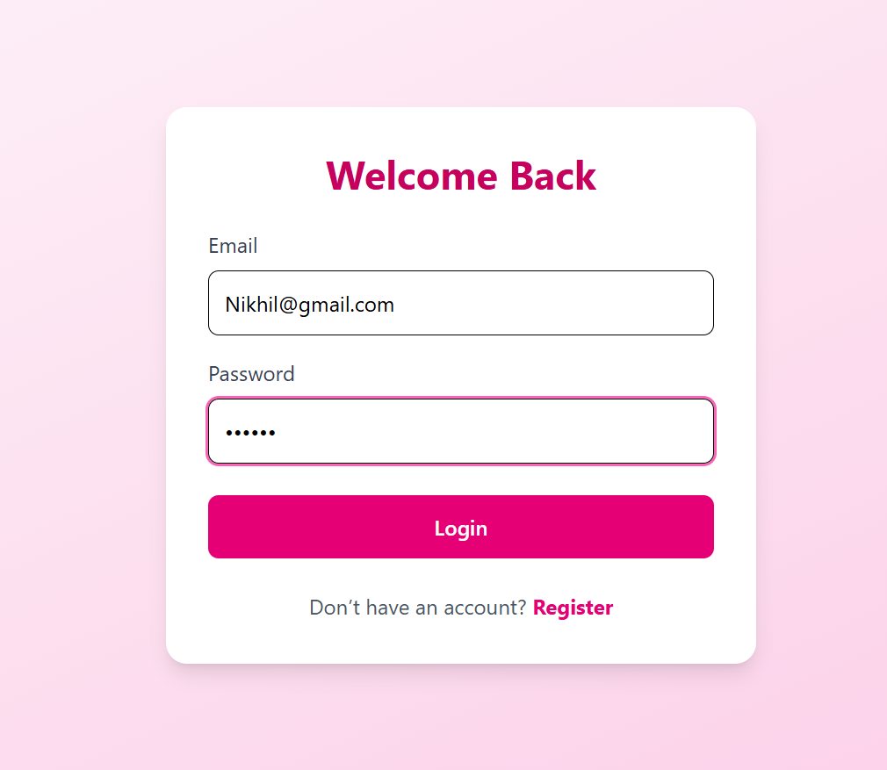
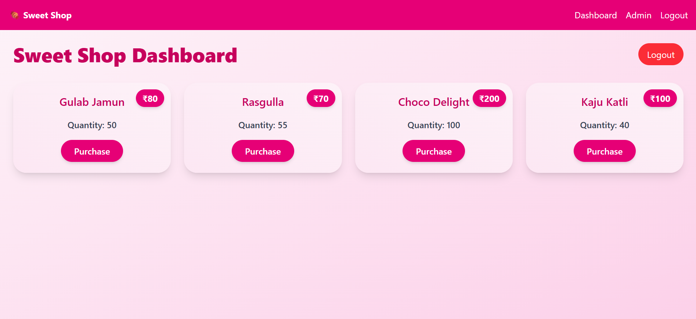
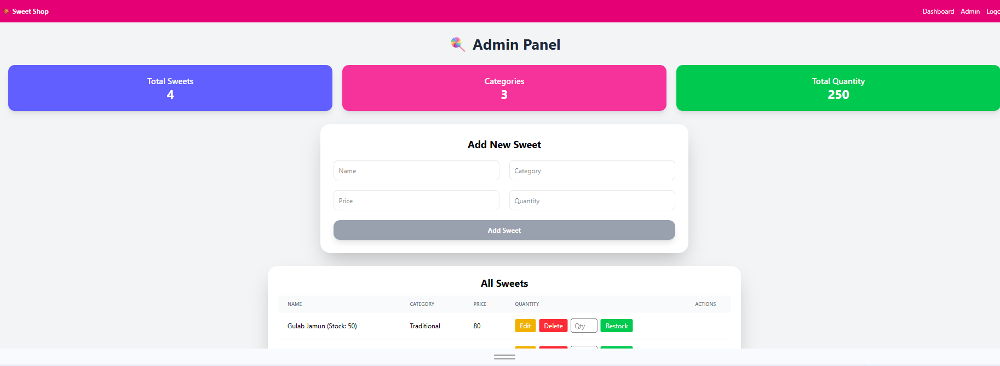

# 🍬 Sweet Shop Management System

  
  
  

A **full-stack Sweet Shop Management** System built using the MERN stack.
This application allows users to register, log in, view sweets, search/filter them, and purchase available items.
Admins can manage inventory by adding, updating, deleting, and restocking sweets.

This project follows clean coding practices, RESTful API design, JWT authentication, and role-based authorization, with a focus on real-world application design.

🚀 Tech Stack

**Frontend**

ReactJS

Tailwind CSS

Axios

React Router DOM

**Backend**

Node.js

Express.js

JWT (Authentication)

bcryptjs (Password hashing)

**Database**

MongoDB (Mongoose)

**Testing**

Jest

Supertest (Backend API testing)

**✨ Features**

🔐 Authentication

User Registration

User Login

JWT-based authentication

Role-based access (User / Admin)

**🍭 Sweet Management**

View all available sweets

Search sweets by:

Name

Category

Price range

Purchase sweets (quantity decreases)

Purchase button disabled when stock = 0

**👑 Admin Features**

Add new sweets

Update sweet details

Delete sweets

Restock sweets

Admin-only protected routes

🧪 Testing

Backend APIs tested using Jest & Supertest

Follows Test-Driven Development (TDD) approach

**📂 Project Structure**

Sweet-Shop-Management-System/

│
├── backend/
│   ├── src/
│   │   ├── config/
│   │   ├── controllers/
│   │   ├── middleware/
│   │   ├── models/
│   │   ├── routes/
│   │   ├── tests/
│   │   ├── app.js
│   │   └── server.js
│
├── frontend/
│   ├── src/
│   │   ├── components/
│   │   ├── pages/
│   │   ├── services/
│   │   ├── utils/
│   │   ├── App.jsx
│   │   └── main.jsx
│
└── README.md

⚙️ Installation & Setup

1️⃣ Clone the Repository

git clone https://github.com/mnikhil38/Sweet-Shop-Management.git

cd Sweet-Shop-Management-System

2️⃣ Backend Setup

cd backend

npm install

Create a .env file in the backend folder:

PORT=5000

MONGO_URI=your_mongodb_connection_string

JWT_SECRET=your_secret_key

Run backend server:

node/nodemon server.js

Backend will run at:

http://localhost:5000

3️⃣ Frontend Setup

cd frontend

npm install

npm run dev

Frontend will run at:

http://localhost:5173

🔑 API Endpoints
Auth

POST /api/auth/register – Register user

POST /api/auth/login – Login user

Sweets (Protected)

GET /api/sweets – Get all sweets

GET /api/sweets/search – Search sweets

POST /api/sweets – Add sweet (Admin)

PUT /api/sweets/:id – Update sweet

DELETE /api/sweets/:id – Delete sweet (Admin)

POST /api/sweets/:id/purchase – Purchase sweet

POST /api/sweets/:id/restock – Restock sweet (Admin)

🧪 Running Tests

cd backend

npm test

This will run all backend unit and integration tests.

📸 ###Screenshots

### Login Page

### Register Page

### Dashboard

### Admin Panel

🤖 My AI Usage

AI Tools Used

ChatGPT

How I Used AI

Generated initial boilerplate code for Express controllers and routes

Helped write and refine Jest test cases

Assisted in refactoring code for better readability and structure

Helped design frontend component structure and routing logic

Assisted in writing this README documentation

My Reflection

AI significantly improved my development speed by handling repetitive tasks and providing structure.
However, I manually reviewed, customized, and validated all logic to ensure correctness, security, and understanding.
AI acted as a development assistant, not a replacement for my own problem-solving skills.

🧠 Interview Discussion Notes

JWT authentication & role-based authorization

Protected routes (frontend & backend)

RESTful API design

TDD approach

Clean code & modular architecture

Responsible AI usage in development

🌱 Future Enhancements

Pagination for sweets list

Order history

Payment gateway integration

Frontend unit testing

Deployment on Vercel & Render

📌 Author

Nikhil
MCA | Full Stack Developer (MERN)

